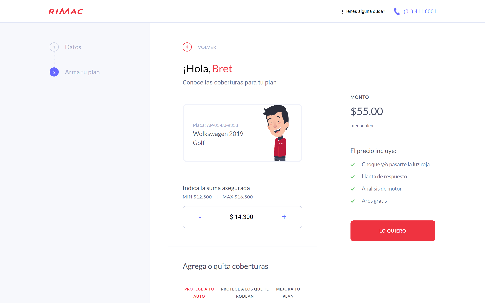

# Cotizador de seguro de autos

- Reto Frontend: cotizador seguro de autos

## Funcionalidad

- En la pagina de login, se valida el campo de phone que coincida con el atributo phone de un usuario de la API: https://jsonplaceholder.typicode.com/users, si coincide continua con la página, de lo contrario mostrará un mensaje con datos inválidos.

- Al agregar o quitar coverturas el monto aumentará o disminuirá como sigue:

  - Monto base = $20
  - Llanta robada = $15
  - Choque y/o pasarte la luz roja = $20
  - Atropello en via Evitamiento = $50

- Al agregar o quitar coverturas automáticamente se incluyen o eliminan en la lista de lo que ofrece el seguro.
- Si la suma asegurada supera los $ 16.000 entonces se eliminara la covertura "Choque y/o pasarte la luz roja" y se actualizara el monto.

## Tencologías Empleadas:

- HTML
- CSS
- Javascript
- React
- Redux
- Sass

## Deployment

[Deployment](https://cotizador-autos-teal.vercel.app)

## Imagenes del Proyecto

